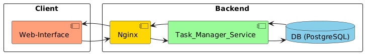

# Tasks Project


## **Задача (Бизнес Задача):**
- Реализация сервиса **"Менеджер задач"**;


## Функциональные требования:
- Реализация **CRUD-операций** для управления задачами (create, get, get_list, update, delete).
- Модель задачи должна иметь в себе: uuid, название, описание, статус (создано, в работе, завершено).


## Схема взаимодействия модулей в проекте:



## Запуск проекта:

### Предварительные условия:
В зависимости от среды запуска, вам следует скопировать параметры виртуальной среды в файл **.env**(в корень проекта) 
из файла [.env_examples](.env_examples).

#### Если запуск происходит локально через **run.py**:
1. Скопируйте параметры виртуальной среды в файл **.env**(в корень проекта). Обязательны параметры, отмеченные 
**[Local]**, например:
- [Local]TASK_MANAGER_POSTGRES_PASSWORD=some_password (пароль должен отличаться от приведенного примера);

2. Убедитесь, что **PostgreSQL** поднят у вас локально. В качестве примера можете поднять БД в **Docker-Compose 
(docker-compose-services.yaml)** (указав параметры, необходимые для **[Docker_Compose]**):
```sh
docker compose -f ./docker-compose-services.yaml up -d
```

3. Установите зависимости:
```sh
pip install -r requirements.txt
```

4. Выполните миграции через **Alembic** (из директории **src**):
```sh
cd ./src
alembic upgrade head
```

5. Запустите проект:
```sh
cd ./src
uvicorn run:app --reload --port 8000
```

6. Перейдите в документацию **Swagger**: http://127.0.0.1:8000/task_manager/docs


#### Если запуск происходит локально через **docker-compose**:
1. Скопируйте параметры виртуальной среды в файл **.env**(в корень проекта). Обязательны параметры, отмеченные 
**[Docker_Compose]**, например:
- [Docker_Compose]TASK_MANAGER_SERVICE_PORT=8001;

2. Запуск проекта:
```sh
docker compose -f ./docker-compose.yaml up -d
```

3. Запуск проекта с открытыми портами сервисов:
```sh
docker compose -f ./docker-compose.yaml -f docker-compose.override.yaml up -d
```

4. Перейдите в документацию **Swagger**: http://127.0.0.1:8000/task_manager/docs


## Основные компоненты сервиса (исходя из технических требований):
- WebAPI: **FastAPI**(ver. 0.116.1, https://fastapi.tiangolo.com/);
- WebService: **Nginx**(ver. 1.29.0, https://nginx.org/en/docs/);
- SQLDB: **PostgreSQL**(ver. 17.5, https://www.postgresql.org/);
- Tests: **Pytest**(ver. 8.4.1, https://docs.pytest.org/);
- Others:
- - **Pydantic**(ver. 2.11.7, https://docs.pydantic.dev/);
- - **SQLAlchemyORM**(ver. 2.0.41, https://docs.sqlalchemy.org/en/20/);
- - **Alembic**(ver. 1.16.4, https://alembic.sqlalchemy.org/en/latest/);
- - **Uvicorn**(ver. 0.35.0, https://www.uvicorn.org/);


## Соглашения разработки:
### GitFlow:
#### Ветки (branches):
- **main**: основная(работоспособная) ветка кода, содержащая код для отправки на ревью;
- **develop**: рабочая ветка, содержащая актуальную кодовую базу для разработки;

#### Работа с ветками:
- Разработка нового функционала: branch: develop -> feature/....;
- Исправление ошибки в новом функционале: branch: develop(main) -> fix/...;

### REST-URI:
#### Версионирование:
- Поддержка **Stripe**-подхода (https://docs.stripe.com/api/versioning);

#### Шаблоны построения URI-методов:
- Ссылка на источник: https://www.vinaysahni.com/best-practices-for-a-pragmatic-restful-api#restful


## Code Style:
- **PEP8**(https://peps.python.org/pep-0008/);
- Docstring-формат - **Epytext**(https://epydoc.sourceforge.net/manual-epytext.html);
- Linters: **Flake8**(https://flake8.pycqa.org/en/latest/);
- **Pre-commit**(https://pre-commit.com/):
- - **black** - авто-форматирование кода;
- - **flake8** - проверка стиля и ошибок;
- - **mypy** - статическая типизация;
- - **isort** - сортировка импортов;
